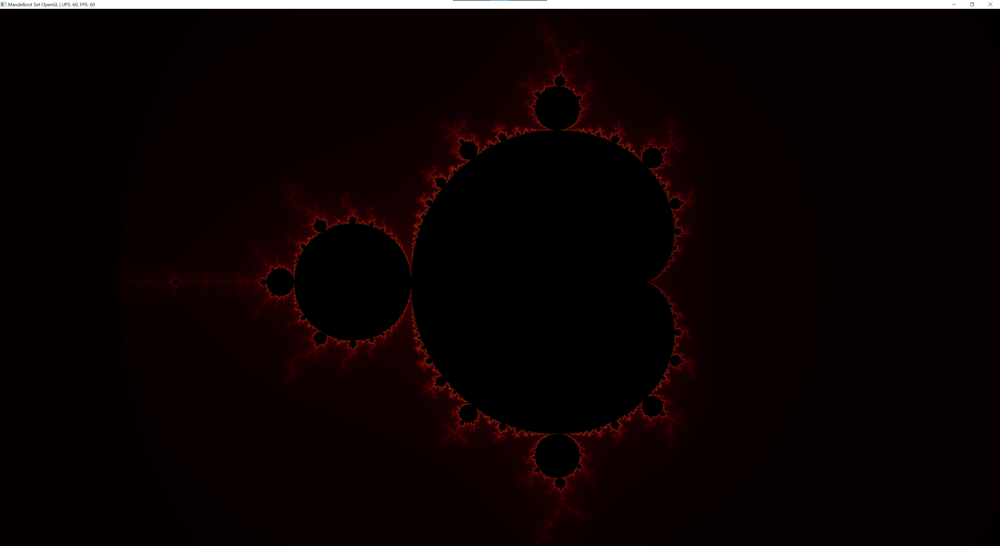
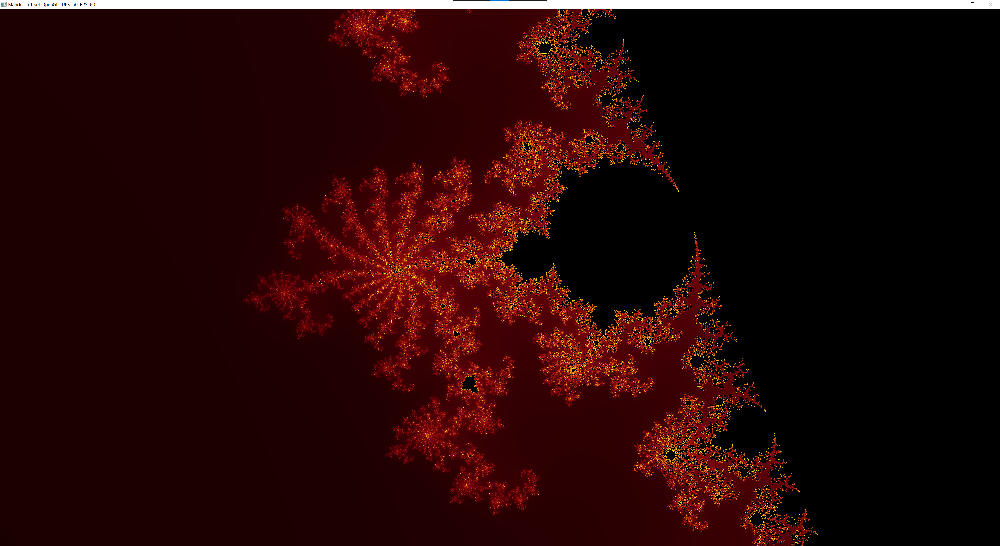
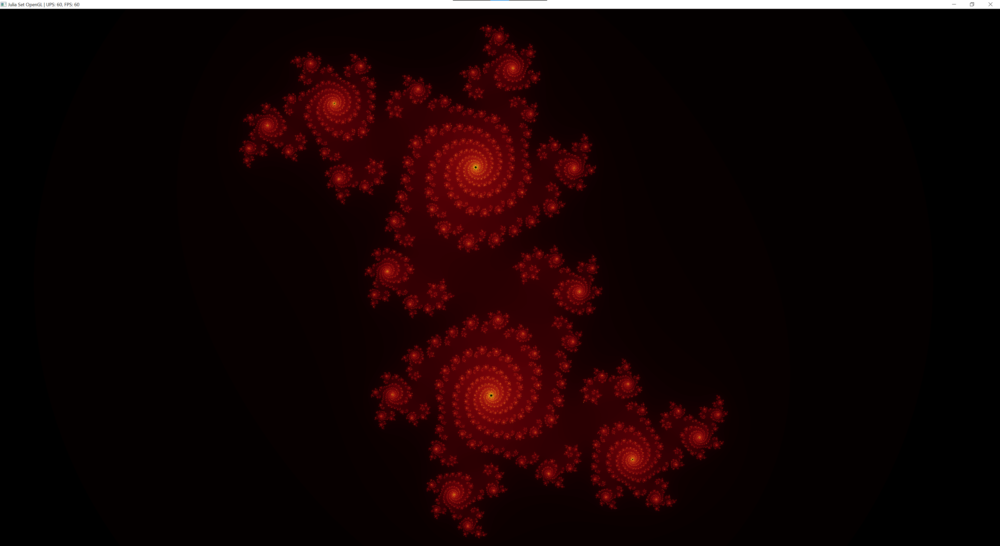
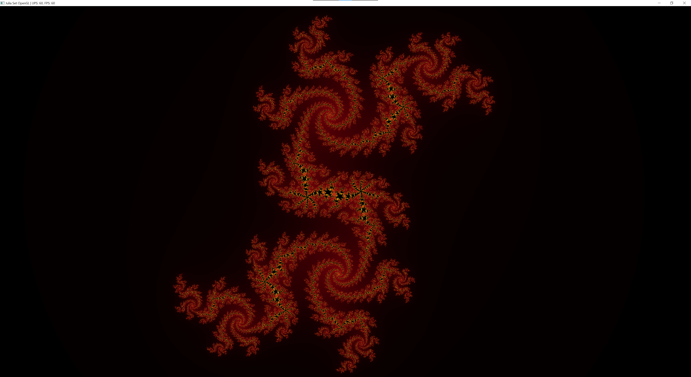
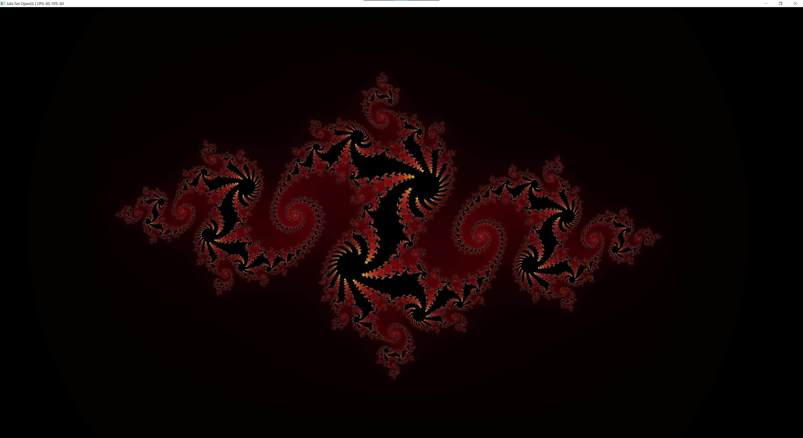

# FractalsOpenGL
This is Mandelbrot and Julia sets visualizer working with OpenGL. All calculations are done on GPU using GLSL shaders. For simplification of window management GLFW and GLAD frameworks were used.  
Fullscreen mode is supported, and UPS and FPS indicator is located at the window title bar.

## Controls
Move:              Arrows or WASD  
Zoom in:           Z or Numpad +  
Zoom out:          X or Numpad -  
Toggle fullscreen: F11  
Change mode:       M  
Close window:      Esc  
Reset position:    0

By default, the Mandelbrot set is displayed. You can explore it with movement and zoom.  
Also, you can switch to Julia set, which works differently. For this set to build it requires an imaginary number as input. This number is created from the mouse position on the window. So, each position of the cursor will create a new Julia set. Most of them are very dark or plain black, so you will have to find regions where they are more interesting. And after finding the set, you may as well explore it with zoom and movement.

## Color pallete
The color palette is built in such a way that points in the set are displayed in black. The rest of them are colored in a gradient from yellow to red to black. It was achieved by putting red and green colors in the power of 0.75 and 4 respectively. This makes the green color decrease its value faster creating a red shade.

## Performance
The previous version of the program was written and tested on 8 thread CPU, and it couldn't give 60 FPS(frames per second) even in 720p resolution. But because GPU has both faster floating-point calculations and better multithreading it can achieve 120 FPS in 4k resolution (2160p). CPU: i5-8300h, GPU: GTX 1050

## Mandelbrot set examples

## Julia set examples

